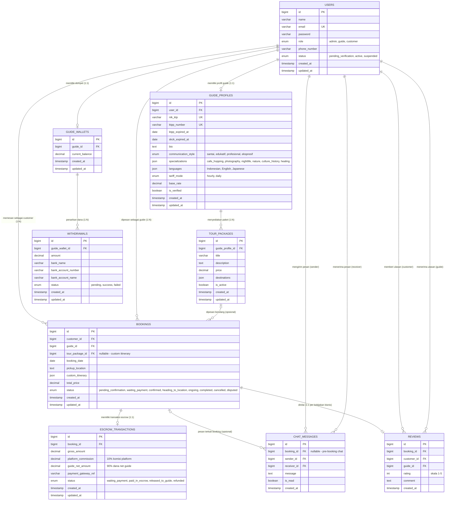
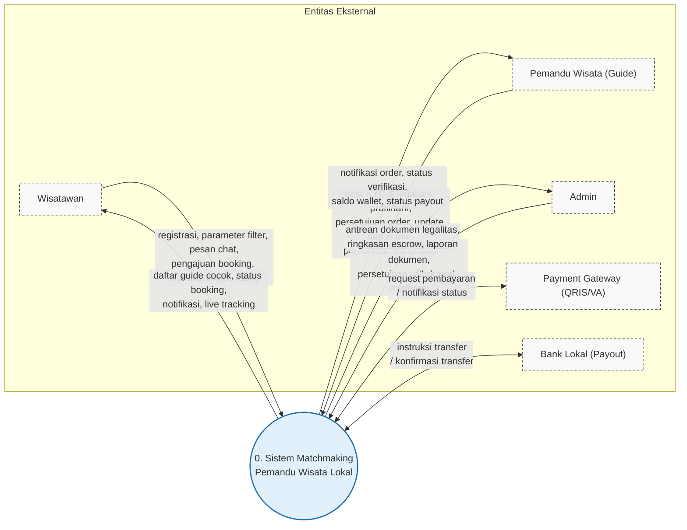

# Diagram Sistem — ERD & DFD

> **Platform Matchmaking Pemandu Wisata Lokal Berbasis Web untuk Mendukung Quality Tourism**

| Atribut     | Nilai                                                                  |
| ----------- | ---------------------------------------------------------------------- |
| Penulis     | I Gede Tio Mahesa Diputra — S1 Sistem Informasi, ITB STIKOM Bali (2026) |
| Teknologi   | Laravel 13, Livewire 4, Tailwind CSS, MySQL                            |
| Sumber      | `.context/srs_document.md`                                             |

## Daftar Isi

1. [Entity Relationship Diagram (ERD)](#1-entity-relationship-diagram-erd)
2. [DFD Level 0 (Diagram Konteks)](#2-dfd-level-0-diagram-konteks)
3. [DFD Level 1](#3-dfd-level-1)
4. [Panduan Penggunaan Diagram](#4-panduan-penggunaan-diagram)

---

## 1. Entity Relationship Diagram (ERD)

Diagram ER memetakan 9 tabel dari skema basis data pada SRS (Bab 3). Relasi ditandai dengan kardinalitas berikut:

| Notasi | Arti                          |
| ------ | ----------------------------- |
| `||`   | Tepat satu (exactly one)      |
| `o|`   | Nol atau satu (zero or one)   |
| `o{`   | Nol atau banyak (zero or many) |



### Catatan relasi penting

1. **users ↔ guide_profiles (1:1)** — hanya user berperan `guide` yang memiliki profil guide berisi persona, legalitas (NIK KTP, KTPP, SKCK), dan parameter matching.
2. **bookings ↔ tour_packages (opsional)** — `tour_package_id` nullable karena wisatawan dapat menyusun *custom itinerary* tanpa memilih paket.
3. **chat_messages.booking_id (nullable)** — chat pre-booking terjadi sebelum booking dibuat (FR-02-02).
4. **bookings ↔ escrow_transactions (1:1)** — setiap booking memiliki satu transaksi escrow yang menyimpan pembagian 10% komisi / 90% net.
5. **bookings ↔ reviews (1:1)** — satu booking hanya dapat dinilai satu kali, muncul saat status `completed` (UAT-W04).

---

## 2. DFD Level 0 (Diagram Konteks)

Diagram konteks menggambarkan sistem sebagai satu proses tunggal (**0. Sistem Matchmaking Pemandu Wisata Lokal**) beserta 5 entitas eksternal yang berinteraksi dengannya.



### Entitas eksternal

| Entitas                | Deskripsi                                     | Aliran Data Masuk (ke sistem)                                  | Aliran Data Keluar (dari sistem)                          |
| ---------------------- | --------------------------------------------- | -------------------------------------------------------------- | --------------------------------------------------------- |
| **Wisatawan**          | Pengguna akhir berusia 19–35 tahun            | Registrasi, parameter filter, pesan chat, pengajuan booking, instruksi pembayaran, rating & ulasan | Daftar guide cocok, status booking, notifikasi, live tracking, permintaan pembayaran |
| **Pemandu Wisata (Guide)** | Mitra terverifikasi berusia 18–35 tahun   | Data KYC (KTP/KTPP/SKCK), profil & tarif, persetujuan order, update status tour, permintaan withdrawal | Notifikasi order, status verifikasi, saldo wallet, status payout |
| **Admin**              | Pengelola platform ITB STIKOM Bali            | Keputusan verifikasi dokumen, persetujuan withdrawal, moderasi | Antrean dokumen legalitas, ringkasan escrow, laporan       |
| **Payment Gateway**    | Penyedia pembayaran QRIS/VA (Midtrans)        | Notifikasi status pembayaran                                   | Request pembayaran                                         |
| **Bank Lokal**         | Bank tujuan transfer payout guide             | Konfirmasi transfer                                            | Instruksi transfer                                         |

---

## 3. DFD Level 1

Diagram Alir Data Level 1 merinci proses tunggal pada diagram konteks menjadi 8 proses fungsional yang memetakan kebutuhan fungsional SRS (Bab 4), beserta 9 data store.

**Legenda notasi (Gane-Sarson):**

- Persegi panjang putus-putus = Entitas Eksternal
- Lingkaran = Proses
- Persegi panjang dua sisi (`[[...]]`) = Data Store

```mermaid
flowchart TB
    subgraph ENT["Entitas Eksternal"]
        W["Wisatawan"]
        G["Pemandu Wisata (Guide)"]
        A["Admin"]
        PG["Payment Gateway (QRIS/VA)"]
        BK["Bank Lokal"]
        SCH["Scheduler (Cron Harian)"]
    end

    subgraph PRO["Proses Sistem"]
        P1(("1.0 Registrasi &<br/>Verifikasi KYC"))
        P2(("2.0 Matchmaking<br/>& Pencarian"))
        P3(("3.0 Pre-Booking<br/>Chat"))
        P4(("4.0 Booking &<br/>Pembayaran Escrow"))
        P5(("5.0 Pelaksanaan<br/>Tour & Tracking"))
        P6(("6.0 Settlement, Wallet<br/>& Withdrawal"))
        P7(("7.0 Rating<br/>& Ulasan"))
        P8(("8.0 Auto-Suspend<br/>Lisensi"))
    end

    subgraph DS["Data Store"]
        D1[["D1 Users"]]
        D2[["D2 Guide Profiles"]]
        D3[["D3 Tour Packages"]]
        D4[["D4 Bookings"]]
        D5[["D5 Escrow Transactions"]]
        D6[["D6 Guide Wallets"]]
        D7[["D7 Withdrawals"]]
        D8[["D8 Chat Messages"]]
        D9[["D9 Reviews"]]
    end

    %% ===================== Proses 1.0 =====================
    W -->|"data registrasi (FR-01-01)"| P1
    G -->|"data KYC: NIK KTP, KTPP, SKCK,<br/>pas foto, SOP sign-off (FR-01-02/03)"| P1
    G -->|"kelola profil, tarif & paket (UAT-P02)"| P1
    P1 -->|"buat user baru (pending_verification)"| D1
    P1 -->|"buat profil guide + dokumen legalitas"| D2
    P1 -->|"simpan/ubah paket wisata"| D3
    P1 -->|"notifikasi antrean dokumen baru"| A
    A -->|"keputusan verifikasi<br/>(approve / reject) (FR-01-04)"| P1
    P1 -->|"update status user (active/suspended)"| D1
    P1 -->|"update is_verified"| D2
    P1 -->|"hasil verifikasi"| G

    %% ===================== Proses 2.0 =====================
    W -->|"parameter filter: spesialisasi,<br/>gaya komunikasi, tarif (FR-02-01)"| P2
    D2 -->|"profil guide terverifikasi"| P2
    D3 -->|"paket & tarif aktif"| P2
    D9 -->|"agregasi rating"| P2
    P2 -->|"daftar guide cocok"| W

    %% ===================== Proses 3.0 =====================
    W -->|"pesan chat"| P3
    G -->|"balasan chat"| P3
    P3 -->|"simpan pesan"| D8
    D8 -->|"riwayat pesan"| P3
    P3 -->|"pesan real-time (FR-02-02)"| W
    P3 -->|"pesan real-time"| G

    %% ===================== Proses 4.0 =====================
    W -->|"pengajuan booking +<br/>custom itinerary (FR-02-03)"| P4
    D3 -->|"hitung total harga"| P4
    P4 -->|"buat booking<br/>(pending_confirmation)"| D4
    P4 -->|"notifikasi order baru"| G
    G -->|"persetujuan order"| P4
    P4 -->|"update status (waiting_payment)"| D4
    P4 -->|"permintaan pembayaran"| W
    W -->|"instruksi pembayaran"| P4
    P4 -->|"request pembayaran QRIS/VA"| PG
    PG -->|"notifikasi status pembayaran"| P4
    P4 -->|"update status (confirmed)"| D4
    P4 -->|"catat escrow (paid_in_escrow)"| D5

    %% ===================== Proses 5.0 =====================
    G -->|"update status tour:<br/>heading_to_location → ongoing →<br/>completed (FR-03-01)"| P5
    D4 -->|"data booking aktif"| P5
    P5 -->|"update status booking"| D4
    P5 -->|"status & progres tour real-time<br/>(FR-03-02)"| W
    P5 -->|"event tour completed"| P6

    %% ===================== Proses 6.0 =====================
    D4 -->|"booking completed"| P6
    P6 -->|"split otomatis: 10%% komisi /<br/>90%% net (FR-03-03)"| D5
    P6 -->|"kredit 90%% ke wallet"| D6
    G -->|"permintaan withdrawal<br/>(FR-04-01)"| P6
    P6 -->|"buat antrean payout (pending)"| D7
    A -->|"persetujuan payout<br/>(FR-04-02)"| P6
    P6 -->|"instruksi transfer"| BK
    BK -->|"konfirmasi transfer"| P6
    P6 -->|"update status payout (success/failed)"| D7
    P6 -->|"debit saldo wallet"| D6
    P6 -->|"saldo & status payout"| G

    %% ===================== Proses 7.0 =====================
    D4 -->|"validasi booking completed"| P7
    W -->|"rating (1-5) & ulasan<br/>(UAT-W04)"| P7
    P7 -->|"simpan ulasan"| D9
    P7 -->|"konfirmasi ulasan tersimpan"| W

    %% ===================== Proses 8.0 =====================
    SCH -->|"trigger 00:00 setiap hari<br/>(FR-04-03)"| P8
    D2 -->|"cek kedaluwarsa KTPP/SKCK"| P8
    D1 -->|"data akun & status"| P8
    P8 -->|"update status user (suspended)"| D1
    P8 -->|"notifikasi auto-suspend"| A

    classDef ext fill:#f9f9f9,stroke:#333,stroke-dasharray:4 3;
    classDef proc fill:#e1f0fa,stroke:#1f6fb2,stroke-width:2px;
    classDef store fill:#fdf6e3,stroke:#b58900,stroke-width:2px;
    class W,G,A,PG,BK,SCH ext;
    class P1,P2,P3,P4,P5,P6,P7,P8 proc;
    class D1,D2,D3,D4,D5,D6,D7,D8,D9 store;
```



> Catatan: pengelolaan profil, tarif & paket guide (UAT-P02) disederhanakan melalui proses 1.0; agregasi rating untuk profil guide dibaca proses 2.0.

### Kamus data store

| Store | Nama Tabel          | Penulis (Proses) | Pembaca (Proses)      |
| ----- | ------------------- | ---------------- | --------------------- |
| **D1** | Users              | 1.0, 8.0         | 8.0                   |
| **D2** | Guide Profiles     | 1.0              | 2.0, 8.0              |
| **D3** | Tour Packages      | 1.0              | 2.0, 4.0              |
| **D4** | Bookings           | 4.0, 5.0         | 5.0, 6.0, 7.0         |
| **D5** | Escrow Transactions| 4.0, 6.0         | 6.0                   |
| **D6** | Guide Wallets      | 6.0              | 6.0                   |
| **D7** | Withdrawals        | 6.0              | 6.0                   |
| **D8** | Chat Messages      | 3.0              | 3.0                   |
| **D9** | Reviews            | 7.0              | 2.0                   |

### Deskripsi proses

| Proses | Pemetaan FR | Fungsi Utama | Input Utama | Output Utama |
| ------ | ----------- | ------------ | ----------- | ------------ |
| **1.0 Registrasi & Verifikasi KYC** | FR-01-01 s/d FR-01-04, UAT-P02 | Registrasi multi-role, KYC bertingkat guide, SOP sign-off, pengelolaan profil/paket, keputusan verifikasi admin | Data registrasi, dokumen legalitas, data profil & paket, keputusan admin | Status user, `is_verified`, paket tersimpan |
| **2.0 Matchmaking & Pencarian** | FR-02-01 | Penyaringan guide berdasar spesialisasi, gaya komunikasi, dan tarif | Parameter filter | Daftar guide cocok |
| **3.0 Pre-Booking Chat** | FR-02-02 | Komunikasi langsung wisatawan-guide untuk penyelarasan ekspektasi & kustomisasi itinerary | Pesan chat | Pesan real-time |
| **4.0 Booking & Pembayaran Escrow** | FR-02-03 | Alur *confirmation-first*: `pending_confirmation` → `waiting_payment` → `confirmed`, dana masuk escrow | Pengajuan booking, persetujuan guide, notifikasi gateway | Booking & transaksi escrow |
| **5.0 Pelaksanaan Tour & Tracking** | FR-03-01, FR-03-02 | State machine status tour oleh guide; live tracking via stepper untuk customer | Update status tour | Status tour real-time, event `completed` |
| **6.0 Settlement, Wallet & Withdrawal** | FR-03-03, FR-04-01, FR-04-02 | Split otomatis 10%/90%, kredit wallet, antrean payout, persetujuan admin, transfer bank | Event `completed`, permintaan withdrawal, persetujuan admin, konfirmasi bank | Escrow `released_to_guide`, saldo wallet, status payout |
| **7.0 Rating & Ulasan** | UAT-W04 | Validasi booking `completed` lalu simpan rating & ulasan | Rating (1–5) & komentar | Ulasan tersimpan |
| **8.0 Auto-Suspend Lisensi** | FR-04-03 | Scheduler tengah malam mendeteksi KTPP/SKCK kedaluwarsa dan meng-suspend akun | Trigger cron, tanggal kedaluwarsa | Status user `suspended` |

---

## 4. File Mermaid Terpisah

Diagram juga tersedia sebagai file Mermaid mandiri (siap dirender / diimpor ke tool lain):

| File                        | Isi                              |
| --------------------------- | -------------------------------- |
| `diagrams/erd.mmd`          | Entity Relationship Diagram      |
| `diagrams/dfd-level-0.mmd`  | DFD Level 0 (Diagram Konteks)    |
| `diagrams/dfd-level-1.mmd`  | DFD Level 1                      |
| `diagrams/sequence.mmd`     | Sequence — alur end-to-end       |

Render satu file ke PNG/SVG:

```bash
npx -y @mermaid-js/mermaid-cli -i .context/diagrams/erd.mmd -o erd.png
```

## 5. Panduan Penggunaan Diagram

File ini menggunakan **Mermaid v10+** dan dirender otomatis di:

- **GitHub / GitLab** — render bawaan pada file `.md`
- **VS Code** — ekstensi *Markdown Preview Mermaid Support* / *Markdown Preview Enhanced*
- **Obsidian / Typora** — render bawaan

Untuk mengekspor ke PNG/SVG, jalankan:

```bash
npx -y @mermaid-js/mermaid-cli -i .context/erd-dfd.md -o erd-dfd.png
```

> **Catatan:** relasi 1:1 pada `bookings → reviews` dan `bookings → escrow_transactions` merupakan kebijakan bisnis (business rule) sesuai alur UAT, bukan batasan kunci unik pada skema.
